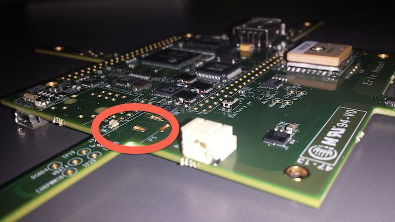

# System Power

The selection of either the 5VDC or the USB as the power source is handled internally to the TPS65217B and automatically switches to 5VDC power if both are connected. SW can change the power configuration via the I2C interface from the processor. In addition, the SW can read the TPS65217B and determine if the board is running on the 5VDC input or the USB input. This can be beneficial to know the capability of the board to supply current for things like operating frequency and expansion cards.

### Power Management Integrated Circuit (PMIC)

The main Power Management IC (PMIC) in the system is the [TPS65217B](http://www.ti.com/product/tps65217b). The *TPS65217B* is a single chip power management IC consisting of a linear dual-input power path, three step-down converters, four LDOs, and a high-efficiency boost converter to power two strings of up to 10 LEDs in series. The system is supplied by a USB port or DC adapter. Three high-efficiency 2.25MHz step-down converters are targeted at providing the core voltage, MPU, and memory voltage for the board.

The step-down converters enter a low power mode at light load for maximum efficiency across the widest possible range of load currents. For low-noise applications the devices can be forced into fixed frequency PWM using the I2C interface. The step-down converters allow the use of small inductors and capacitors to achieve a small solution size.

LDO1 and LDO2 are intended to support system-standby mode. In SLEEP state output current is limited to 100uA to reduce quiescent current whereas in normal operation they can support *up to 100mA each*. LDO3 and LDO4 can support up to *285mA each*.
By default **only LDO1 is always ON** but any rail can be configured to remain up in SLEEP state. Especially the DCDC converters can remain up in a low-power PFM mode to support processor Suspend mode. The TPS65217B offers flexible power-up and power-down sequencing and several house-keeping functions such as power-good output, pushbutton monitor, hardware reset function and temperature sensor to protect the battery.

The selection of either the 5VDC or the USB as the power source is handled internally to the TPS65217B and automatically switches to 5VDC power if both are connected. Software can change the power configuration via the I2C interface from the processor. In addition, the **software can read the TPS65217B and determine if the board is running on the 5VDC input or the USB input**. This can be beneficial to know the capability of the board to supply current for things like operating frequency and expansion cards.

### 5V DC Power Input

A 5V DC supply can be used to provide power to the board. The power supply current depends on how many and what type of add on boards are connected to the board. For typical use, a 5VDC supply rated at 1A should be sufficient. If heavier use of the expansion headers or USB host port is expected, then a higher current supply will be required. A NCP349 over voltage device is used to prevent the plugging in of 7 to 12 V power supplies by mistake. The NCP349 will shut down and the board will not power on. No visible indicator is provided to indicate that an over voltage condition exists. The board will not power up.

------

**The 5V DC Power input is not populated. If needed, solder a 2.1MM center positive x 5.5mm outer barrel connector**

------

### USB Power

The board can also be powered from the USB port. A **typical USB port is limited to 500mA maximum**. When powering from the USB port, the `VDD_5V` rail is not provided to the expansion header. So Capes that require that rail will not have that rail available for use.

The 5VDC supply from the USB port is provided on the `SYS_5V` rail of the expansion header for use by a Cape.

### Power consumption

| MODE | USB (mA) | DC (mA)* | DC + USB (mA) |
| -----|-----|----|----------|
|Reset| 200 | *80* | 220 |
| UBoot | 370 | *250* | 330 |
| Kernel booting (peak) | 510 | *360* | 470 |
| Kernel Idling | 300 | *180* | 300 |

---

\* This column shows the approximate consumption of the board when powered from the ESCs (5V BEC).

---

When the USB is connected, the FT2232 and HUB are powered up which causes an increase in the current. If the USB is not connected, these devices are in low power state, therefore this saves roughly 120mA of current and is the reason for the increased current when the USB is connected.

The current will fluctuate as various activates occur, such as the LEDs on and SD card accesses.

