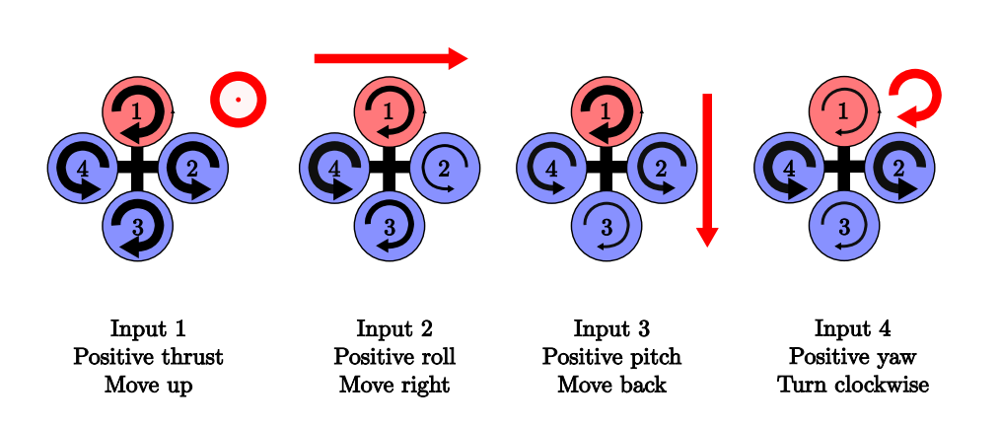

Modelo dinámico
=========

¿Qué es el modelo dinámico ?
-------
El *modelo dinámico* es un **conjunto de ecuaciones que describen la actitud y posición del dispositivo.**

concepto quadrotor
-------
El robot [Erle] (http://erlerobot.com) es un *quadricóptero*:

> Un quadricóptero, también llamado un helicóptero quadrotor , quadrotor , es un helicóptero multirotor que es levantado y propulsado por cuatro rotores. Quadcopters se clasifican como helicópteros , en oposición a las aeronaves de ala fija , porque su elevación es generada por un conjunto de perfiles de ala giratoria estrecha - acordes.

Desde el ï¬ Días RST en el desarrollo del helicóptero, el diseño quadrotor fue visto como una alternativa. En un helicóptero Coni ¬ regular? ? Guración del par es contrarrestado por el rotor de cola . Cuando se utilizan dos rotores de los pares de los rotores pueden compensado por unos a otros . Pero dos rotores crear aún tiene desafíos en el control como los movimientos de rotación y traslación son aún altamente acoplados .

Con cuatro rotores del control se hace más fácil y los movimientos de rotación se puede desacoplar de los ¬ IE € ects giroscópicos . Movimientos de traslación se logran por la inclinación del vehículo . En la disposición más común para quadrotor , los * dos pares de rotores ( 1 , 3 ) y ( 2 , 4 ) a su vez en direcciones opuestas * como se muestra en la figura:

Mediante la variación de la velocidad del rotor, uno puede cambiar las fuerzas de elevación y crear movimiento. El aumento o la disminución de las cuatro velocidades de rotor juntos genera un movimiento vertical. El cambio de los 2 y 4 hélices aceleran produce a la inversa ** ** rollo rotación , junto con el movimiento lateral. Paso ** ** rotación y el resultado de movimiento lateral correspondiente de 1 y 3 hélices de velocidad inversa modii ¬ ? Ed. Yaw ** ** Resultados de rotación del ¬ Dii € rencia en la lucha contra el par entre los pares de rotores .

### Ventajas y desventajas
Puesto que sólo empujó el control se puede utilizar para cambiar de posición, control de la hoja de paso de los rotores no es necesario y por lo tanto la mecánica del rotor * son simpliï ¬ ? Ed , que hacen que el diseño quadrotor interesante para los más pequeños de tamaño vertical / Short Take Oï ¬ € y aterrizaje UAVs ( V / STOL ) ( Unmanned Aerial Vehicles ) * . Otra ventaja es
que con un quadrotor el empuje se utiliza únicamente para compensar el peso y no para contrarrestar el par de torsión , debido a que los cuatro rotores eliminar el IE giroscópico ¬ € ect , de modo de empuje se utiliza completamente para llevar la carga útil .

Para micro UAVs , cuatro resultados rotores en un diámetro muy pequeño rotor , que penaliza la IE ¬ ƒciency y aumenta el consumo de energía para conseguir la elevación similar. También el tamaño y el peso de una carga útil con quadrotor similares es más alto que un helicóptero normal. El ¬ simpliï ? Cationes en la construcción y control que es oï ¬ € Ered por el concepto , hace que sea todavía un diseño muy favorable para UAVs .

Modelo dinámico de un quadrotor
-------

El modelo dinámico * del * quadrotor es básicamente la de un cuerpo rígido que rota con seis grados de libertad y cuatro entradas .

De acuerdo con [ QuadCopter Dynamics, simulación y Control](http://andrew.gibiansky.com/downloads/pdf/Quadcopter%20Dynamics,%20Simulation,%20and%20Control.pdf):

> El desarrollo de quadcopters ha estancado hasta hace muy poco , porque ** controlar cuatro rotores independientes ha demostrado ser increíblemente difícil ** e imposible sin la ayuda electrónica. La disminución del costo de los microprocesadores modernos ha hecho del control electrónico e incluso completamente autónoma de quadcopters viables para fines comerciales, militares , e incluso aficionados .
>
> Quadcopter de control es un problema fundamentalmente difícil e interesante :
>
> Con * los seis grados de libertad * (tres de traslación y tres de rotación ) y sólo * cuatro entradas independientes * (velocidades de rotor ) , quadcopters están severamente subactuado ** . **
Con el fin de lograr seis grados de libertad , un movimiento de rotación y de traslación están acoplados . Las dinámicas resultantes son altamente no lineales , sobre todo después de considerar los efectos aerodinámicos complicados. Por otra parte , a diferencia de los vehículos de tierra , los helicópteros tienen muy poca fricción para evitar su movimiento , por lo que deben proporcionar su propio amortiguación con el fin de dejar de moverse y se mantienen estables.
>
> En conjunto, estos factores crean un problema de control muy interesante.

Hay muchos artículos , ponencias y tesis que discuten el modelo dinámico del quadcopter pero nos gusta personalmente [ Diseño, implementación y ï ¬ , ight prueba de la navegación interior y sistema de control para un UAV quadrotor ] ( http://www.st . ewi.tudelft.nl / ~ koen/in4073/Resources/MSc_thesis_X-UFO.pdf ) .

Fuentes
-----
- [ Diseño, implementación y ï ¬ , ight prueba de la navegación interior y sistema de control para un UAV quadrotor ] ( http://www.st.ewi.tudelft.nl/ ~ koen/in4073/Resources/MSc_thesis_X-UFO.pdf )
- [ Quadcopter Dinámica , Simulación y Control](http://andrew.gibiansky.com/downloads/pdf/Quadcopter%20Dynamics,%20Simulation,%20and%20Control.pdf)
- [ Quadcopter ] ( http://en.wikipedia.org/wiki/Quadcopter )

