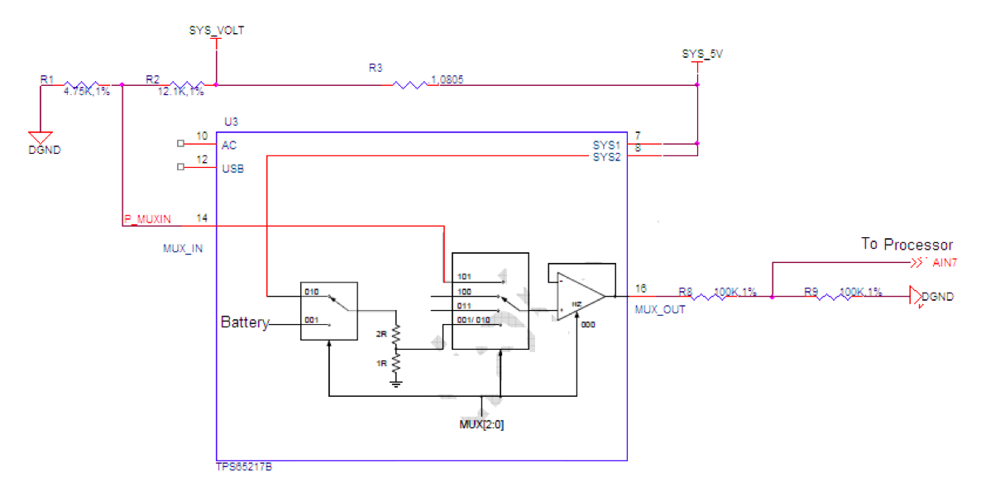

# Medición de la corriente 

El BeagleBone tiene un método según el cúal se puede medir el consumo de corriente de la placa, sin contar los puertos USB y las placas de expasión. La caída de tensión en un resistencia de `0.1 ohmios` se mide para determinar el consumo de corriente.



### Conexión `SYS_5V` 

La pista `SYS_5V` se mide para determinaar la parte alta de las resistencias serie. La pista `SYS_VOLT` esta conectado al pin `MUX_OUT`. Antes de ser conectado al segundo multiplexor interno, el voltaje es dividido por 3. Una señal de `5V` dará lugar a una tensión de `1.66V` en el pin `MAX_OUT`.

### Conexión `SYS_VOLT`

La pista `SYS_VOLT` se mide para determinar la parte alta ade la resistencia en serie. La pista `SYS_VOLT` esta conectado a la `MUX_OUT` mediente el establecimiento de los registro de la TPS65217B. Las resistencias `R1`y `R2`se proporcionan para mantener la misma configuración de divisor de tensión tal como se encuentra en la pista de `SYS_5V` situado internamente en la TPS65217B. Sin embargo, una pista de 5V le dará `1.41V` en contraposición a `1.66V` encontrado internamente en TPS65217B. Esto se resuelve con divisor de 2.8. Asegurate de trabajar con esto en sus cálculos.

### Conexión `MUX_OUT`

La conexión `MUX_OUT` esta divida en 2 partes antes de ser conectado al procesador. La razón de esto es que si se conecta el voltaje de la batería, no tiene divisor de corriente internamente. Si está conectado podría dañar al procesador. En el cálculo de las tensiones de cada lado de las resistencias, que la tensión se divide por 2. Asegúrate de incluir esto en sus cálculos.

### Cálculo de la corriente
El cálculo de la corriente se basa en `1mV` es igual a `1mA`. Se puede utilizar la siguiente fórmula para calcular la corriente utilizando las lectura del voltaje leído por el procesador.

```
(((SYS_5V*2)*3.3)-((SYS_VOLT*2)*3.54)))/.1= Total (mA)
```
