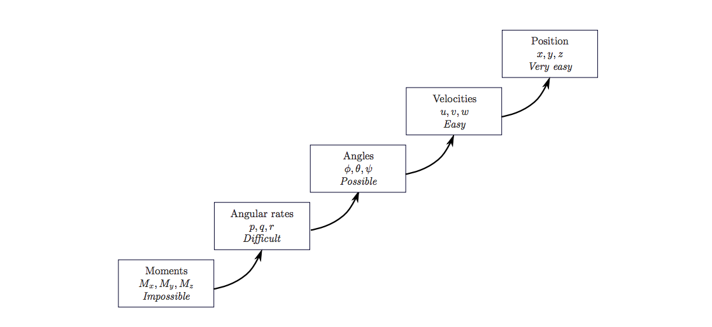

# Autopilot

Un **Autopiloto es un sotfware que proporciona asistencia mientras se controla un drone**. Mientras que muchos autopilotos permiten al drone volar/moverse siguiendo algunos puntos geográficos (por ejemplo GPS) de manera autónoma, el movimiento autónomo es una característica del autopiloto, pero no es autopiloto.

De acuerdo con la [Wikipedia](http://en.wikipedia.org/wiki/Autopilot):

>Un piloto automático es un sistema utilizado para controlar la trayectoria de un vehículo sin requerir el control constate de un humano. Los pilotos automáticos no sustituyen a un operador humano, sino ayuda a controlar el vehículo, lo que permite centrarse en aspectos más amplios de la operación, tales como el seguimiento de una trayectoria, el clima y los sistemas. [1] Los pilotos automáticos se utilizan en aviones, barcos (conocido como el gobierno del timón), naves espaciales, misiles, y otros. Los pilotos automáticos han evolucionado significativamente con el tiempo, desde los primeros pilotos automáticos que simplemente mantienen una actitud hasta los pilotos automáticos modernos capaces de realizar aterrizaes automáticos, bajo la supervisión de un piloto.

Para entender esto mejor, vamos a analizar las diferentes formas de controlar un ** quadricoptero**, un avión no tripulado de vuelo rotativo:



Dependiendo de la variable controlada la precepción del control de un quadricoptero por un piloto se percibe de manera diferente. De acuerdo con la imagen, el caso más facil para el piloto es controlar la **posición deseada ($_d$)** a través de $x_d$, $y_d$ and $z_d$ (todavía hay un nivel más para completar el vuelo autónomo donde el piloto puede establecer el punto de inicio y fin deseado).

```
La tarea de un piloto automático es abstraer al usuario de los diferentes parámetros físicos (tales como la velocidad, velocidades angulares o momentos) y ofrecer una interfaz sencilla para que el pilotaje sea tan facil como sea posible.
```

### Piloto automático en Erle

Hemos estado trabajando duro con [BeaglePilot](../beaglepilot/BeaglePilot.md), un piloto automático completo basado en Linux basado en Ardupilot que proporciona todas la herramientas necesarias y se ha construido gracias a la colaboración entre diferentes entidades y colaboradores.

Aunque *no debe utilizar en drones reales*, tambien ofrecemos un [piloto automático simplicado](../beaglepilot/SimpleAutopilot.md) implementado en python que se debe utilizar para cuestiones pedagógicas.

### Fuentes

- [Design, implementation and flight test of indoor navigation and control system for a quadrotor UAV](http://www.st.ewi.tudelft.nl/~koen/in4073/Resources/MSc_thesis_X-UFO.pdf)
- [Wikipedia](http://en.wikipedia.org/wiki/Autopilot)


